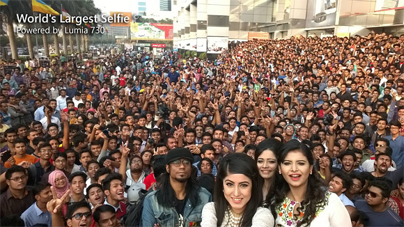
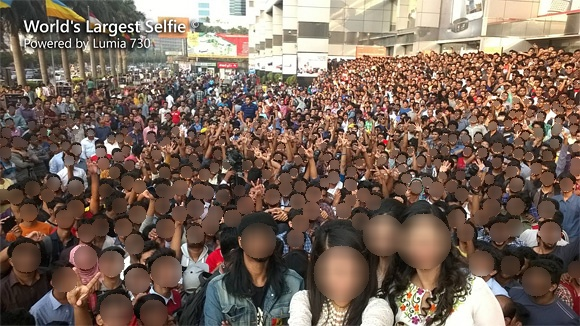
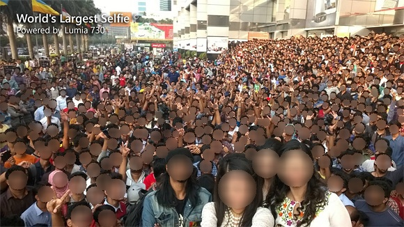

# Blur faces 
This repo aims to detect and blur faces in photos or videos.
The implementation is designed to be minimal: for any request/suggesting, please open an issue.

No future implementation are planned, but few tweaks might be developed.

## Install
```
pip install -r requirements

python main.py
```
Remember to change the input image in main.py

## Results:

| model              | output                             | seconds             |
|--------------------|------------------------------------|---------------------|
| input              |                |                     |
| yolov8-lite-s.onnx |  | 0.21190285682678223 |
| yolov8-lite-t.onnx |  | 0.08756518363952637 |
| yolov8n-face.onnx  |   | 0.09910988807678223 |

## Streaming:
For streaming, refear to _streaming.py_


